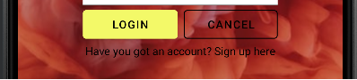

## Al ejecutar la aplicación, lo primero que verá el usuario setá un splash en el que se podrá ver el logo de la aplicación parpadeando
## y el nombre de la aplicación justo debajo.
  
#### Para poder ver el código del Splash, puede dirigirse a los siguientes enlaces: 
* [Splash Java](https://github.com/Nereare4/First/blob/prueba/app/src/main/java/com/nramos/first/Splash.java) 
* [Splash XML](https://github.com/Nereare4/First/blob/prueba/app/src/main/res/layout/activity_splash.xml)

### Al terminar la pantalla de carga, se iniciará directamente el login de la aplicación

#### Para poder ver el código del Login, puede dirigirse a los siguientes enlaces:
* [Login Java](https://github.com/Nereare4/First/blob/prueba/app/src/main/java/com/nramos/first/LoginActivity.java)
* [Login XML](https://github.com/Nereare4/First/blob/prueba/app/src/main/res/layout/activity_login.xml)

  * #### En el Login, el usuario podrá observar que su foto de perfil hace una pequeña animación.

 * #### El usuario tabambién podrá registrarse haciendo uso de los TextInputLayout.

 * #### Más abajo el usuario encontrará dos botones, el botón del Login permitirá al usuario acceder a la 
#### función principal de la aplicación. Si hace click en la frase justo debajo de los botones, le permitirá acceder al SignUp de la aplicación

